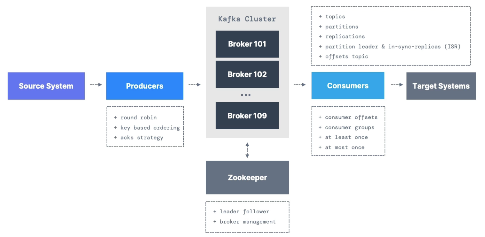
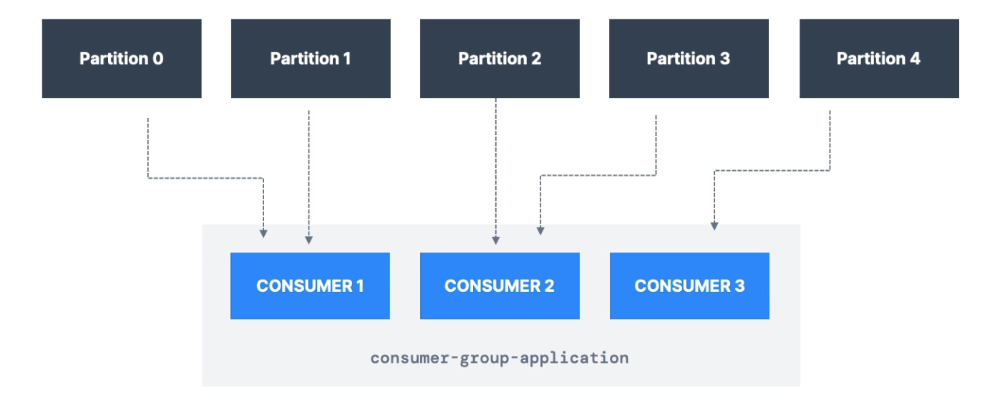

# Kafka

### Why Apache Kafka
* An organization may have multiple source systems and target systems and these systems would keep growing. As these source and target systems grow in number and complexity, it increases the number of integrations needed to get data from source to target system. Apache Kafka can help solve this problem as it is the distributed streaming platform, it helps decouple the source (producer) and target (consumer) system.

### Use Cases
* Messaging system
* Activity tracking
* Gather metrics from many different locations
* Application logs gathering
* Stream processing (Steam API)
* Decoupling of system dependencies
* Micro-services pub/sub
* Remember that Kafka is only used as a transportation mechanism!

### Kafka Topics
* Kafka Topics - a particular stream of data (similar to table in database, though there is no data verification)
* A Kafka topic is identified by its name
* The sequence of messages is called a data stream
* You cannot query topics, instead use Kafka producers to send data and Kafka consumers to read data
* Topics are split in partitions
  * Messages within each partition are odered
  * Each message within a partition gets an incremental id, called offset
* Kafka topics are immutable: once data is written to a partition, it cannot be changed

### Kafka
* Created by LinkedIn, now open-source
* Distributed, resilient, and fault tolerant - You can upgrade Kafka without taking the whole system down
* Horizontal scalability - You can add brokers to Kafka cluster, can scale to 100s of brokers
* High performance (latency of less than 10ms) - real time


### Partitions and offsets
* Topics are split in partitions
  * Messages within each partition are ordered, order is guaranteed only within a partition (not across partitions)
  * Each message within a partition gets an incremental id, called offset. Note that offsets are scoped to a partition i.e. offsets only have meaning for a partition. Two different partitions under a topic with the same offset do not represent the same data.
* Kakfa topics are immutable i.e. once data is written to a partition, it cannot be changed. You cannot delete or update.
* Data is kept in Kafka for a limited time, default is a week - configurable
* Data is assigned randomly to a partition, unless a key is provided

### Producers
* Producers write data to Kafka topics (which are made of partitions)
* Prodicers know (and decide) in advance which partition to write to, based on the key they choose
* Producers can choose to send a key with the message
  * If key=null, data is sent round robin fashion to partitions
  * If key!=null, then all messages for that key will always go to the same partition (hashing)
  * A key is typically sent if you need message ordering for a specific field

### Kafka Message Anatomy
```
+-----------------------------------------------------------+
|                    Key - binary                           |
|                     (Can be null)                         |
+-----------------------------------------------------------+
|                   Value - binary                          |
|                     (Can be null)                         |
+-----------------------------------------------------------+
|                  Compression Type                         |
|     (none, gzip, snappy, lz4, zstd)                       |
+-----------------------------------------------------------+
|                   Headers (optional)                      |
|  +-------------------+-------------------+                |
|  |       Key         |       Value       |                |
|  +-------------------+-------------------+                |
|  |       Key         |       Value       |                |
|  +-------------------+-------------------+                |
+-----------------------------------------------------------+
|                 Partition + Offset                        |
+-----------------------------------------------------------+
|         Timestamp (system or user set)                    |
+-----------------------------------------------------------+
```

### Kafka Message Serializer/Deserializer
* Kafka only accepts bytes as an input from producers and send bytes out as an output to consumers
* Serializer is only used on the value and the key
* The message payload schema must not change during a topic lifecycle as that would result in deserialization failure for the consumer, instead create a new topic 


### Consumers
* Consumers read data from a topic (identified by name) - pull model
* All the consumers in an application read data as a consumer group
* Each consumer within a group reads from exclusive partitions, it's not 1:1 mapping so a consumer within a consumer group can exclusively read from multiple partitions
* You can have multiple "consumer groups" reading from the same topic (but within a consumer group, only one consumer will be assigned to a partition, though a consumer can be assigned to multiple partitions)


### Consumer Offsets
* Kafka stores the offsets at which a consumer group has been reading
* The offsets committed are in Kafka topic named `__consumer_offsets` (internal Kafka topic)
* There are 3 delivery semantics for consumer
  * At least once (usually preferred)
    * Offsets are committed after the message is processed
    * If processing goes wrong, message will be read again. Make sure the processing is idempotent as this can result in duplicate processing of messages
  * At most once
    * Offsets are committed as soon as messages are received
    * If the processing goes wrong, some messages will be lost (they won't be read again)
  * Exactly once
    * For Kafka -> Kafka workflows: use the Transactional API (Kafka Streams API)
    * For Kafka -> External system workflows: use an idempotent consumer


### Kafka Brokers
* A Kafka cluster is composed of multiple brokers (servers)
* Each broker is identified with its ID
* Each broker contains certain topic partitions
* After connecting to any broker (called a bootstrap broker), you will be connected to the entire cluster
* A good number to get started is 3 brokers, but some big clusters have over 100 brokers
* Every Kafka broker is also called a "bootstrap server"

### Topic Replication
* Topics should have a replication factor > 1 (usually between 2 and 3)
* Leader of a partition - An any time only one broker can be a leader for a given partition, other brokers will replicate the data
* Producers can only send data to the broker that is ledaer of a partition
* Therefore, each partition has one leader and multiple ISR (in-sync replica)
* Kafka producers can only write to the leader broker for a partition
* Kafka consumers by default will read from the leader broker for a partition

### Producer Acknowledgements
* Producers can choose to receive acknowledgements of data writes


### Zookeeper
* Zookeeper manages brokers but slowly disappearing
* Zookeeper helps in performing leader election for partitions
* Kafka 2.x can't work without Zookeeper
* Kafka 3.x can work without Zookeeper - using Kafka Raft instead
* Kafka 4.x will not have Zookeeper
